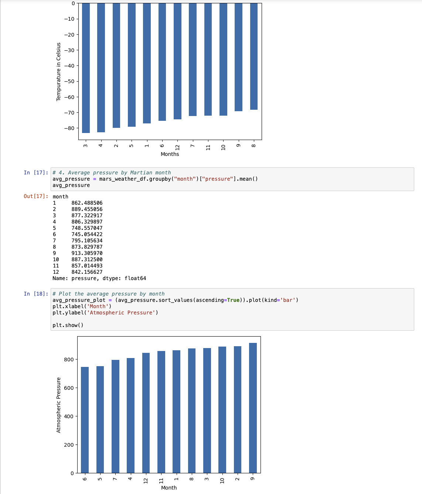
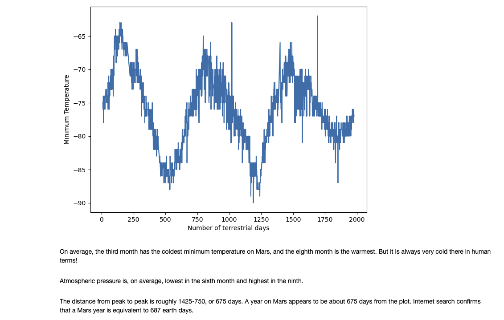

# WebScraping Mars News Challenge

### Overview

We are now prepared to embark on a comprehensive web-scraping and data analysis project. Through the learning, we've acquired the ability to identify HTML elements on a page, recognize their id and class attributes, and utilize this knowledge to extract information using both automated browsing with Splinter and HTML parsing with Beautiful Soup.  The expertise encompasses scraping various types of data, such as HTML tables and recurring elements like multiple news articles on a webpage.

While tackling this Challenge, it's crucial to acknowledge that we're reinforcing the fundamental skills you've been developing thus far: collecting data, structuring and storing data, analyzing data, and subsequently conveying your findings visually.

### Section 1: Extract Headlines and Excerpt from Mars News
* Access the Jupyter Notebook provided in the starter code directory titled part_1_mars_news.ipynb. Navigate within this code to implement the following steps, allowing you to scrape content from the Mars News website.

* Employ automated browsing to explore the Mars news site [Link to Mars news site]. Conduct an inspection of the page to identify the specific elements suitable for scraping.

* Generate a Beautiful Soup object and utilize it to retrieve textual components from the website.

* Retrieve the titles and preview text of the collected news articles. Organize the scraping outcomes within Python data structures in the following manner:

    * For each title and its associated preview, create a Python dictionary with two keys: "title" and "preview".
    * Save all the dictionaries within a Python list.
    * Display the list within your notebook.

### Section 2: Gather and Analyze Mars Weather Information
* Access the Jupyter Notebook provided in the starter code directory labeled part_2_mars_weather.ipynb. Proceed to use this code to execute the following steps, enabling the scraping and analysis of Mars weather data.

* Leverage automated browsing to explore the Mars Temperature Data Site [Link to Mars Temperature Data Site]. Conduct a thorough inspection of the page to identify the specific elements suitable for scraping.

* Generate a Beautiful Soup object and utilize it to extract data from the HTML table. Note that alternatively, this can be accomplished using the Pandas read_html function. However, for the purpose of further refining your web scraping skills, Beautiful Soup is used in this context.

* Aggregate the extracted data into a Pandas DataFrame. The columns within the DataFrame should align with the headings displayed on the website's table. Here's an elucidation of the column headers:

    * id: Identification number of an individual transmission from the Curiosity rover
    * terrestrial_date: Date on Earth
    * sol: Number of elapsed sols (Martian days) since Curiosity's landing on Mars
    * ls: Solar longitude
    * month: Martian month
    * min_temp: Minimum temperature in Celsius for a single Martian day (sol)
    * pressure: Atmospheric pressure at Curiosity's location

* Inspect the current data types associated with each column. If required, perform data type conversions or casting to ensure the appropriate representation as datetime, int, or float data types.

Analyze your dataset by utilizing Pandas functions to address the following inquiries:

1. How many months are present on Mars?
2. How many Martian days, exclusive to Earth days, are encompassed within the collected dataset?
3. What are the coldest and warmest months on Mars at the location of Curiosity? To resolve this query:
    * Compute the average minimum daily temperature across all months.
    * Visualize the outcomes using a bar chart.
4. Which months exhibit the lowest and highest atmospheric pressure on Mars? To address this:
    * Calculate the average daily atmospheric pressure for all months.
    * Represent the results via a bar chart.
5. Approximately, how many terrestrial (Earth) days constitute a Martian year? To determine this:
    * Consider the duration Mars takes to orbit the Sun concerning the elapsed Earth days during that period.
    * Make a visual estimation by plotting the daily minimum temperature.
6. Export the DataFrame to a CSV file for further reference.

## How to Install and Run the script

To run this script:
1. Copy the git link in your local git repository
2. Ensure *Starter_Code* directory is present, inside the *Starter_Code* directory, *part_1_mars_news.ipynb* and *part_2_mars_weather.ipynb* Jupyter Notebook files are present. 
3. Additionally, *mars_weather_df.csv* the output file (from *part_2_mars_weather.ipynb* file) is present
4. Run the script using **Jupyter Notebook** from *Starter_Code* directory and view results
5. Be sure to run the entire script using *Restart & Run All option* from *Kernel* in *Jupyter Notebook* to get error free results
6. Or, you could alternatively run each block of code individually starting from the very top 

## Credits:
To write this script, I used the starter code provided and followed the challenge requirements meticulously  

